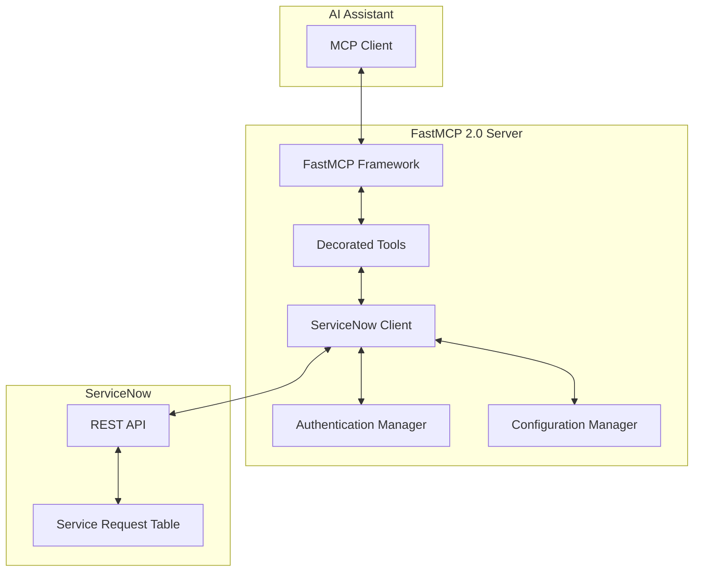

# Design Document: ServiceNow MCP Server

## Overview

The ServiceNow MCP Server is a Model Context Protocol implementation that provides AI assistants with standardized tools for managing ServiceNow Service Requests. Built using **FastMCP 2.0**, it exposes ServiceNow's REST API functionality through a secure, well-defined interface that follows MCP protocol standards.

FastMCP 2.0 is a Python framework that simplifies MCP server development by handling protocol boilerplate, allowing developers to focus on building tools and resources. The server acts as a bridge between AI applications and ServiceNow, enabling natural language interactions with Service Request management workflows through decorated Python functions.

## Architecture

The system follows a layered architecture with clear separation of concerns:



**Layer Responsibilities:**
- **FastMCP Framework**: Handles MCP protocol communication, tool discovery, and request/response formatting automatically
- **Decorated Tools**: Python functions decorated with @mcp.tool that expose ServiceNow operations
- **ServiceNow Client**: Handles HTTP communication with ServiceNow REST API
- **Authentication Manager**: Manages credentials, tokens, and authentication lifecycle
- **Configuration Manager**: Handles server configuration and environment settings

## Components and Interfaces

### FastMCP Server Instance
The core FastMCP instance that manages the MCP server lifecycle and tool registration.

**Initialization:**
```python
from fastmcp import FastMCP

mcp = FastMCP(name="ServiceNowServer")
```

### Tool Definitions
Tools are Python functions decorated with `@mcp.tool` that expose ServiceNow operations to AI assistants.

**Available Tools:**
- `create_service_request`: Creates new Service Requests
- `get_service_request`: Retrieves Service Request by ID or number
- `update_service_request`: Updates existing Service Request fields
- `search_service_requests`: Searches Service Requests with filters
- `list_service_requests`: Lists Service Requests with pagination

**Tool Implementation Pattern:**
```python
@mcp.tool
def create_service_request(
    short_description: str,
    description: str = "",
    requested_for: str = "",
    priority: str = "3"
) -> dict:
    """Create a new Service Request in ServiceNow.
    
    Args:
        short_description: Brief summary of the request
        description: Detailed description
        requested_for: User sys_id or username
        priority: Priority level (1-5, default 3)
    
    Returns:
        Dictionary with request number, sys_id, and created request data
    """
    client = get_servicenow_client()
    return client.create_request({
        "short_description": short_description,
        "description": description,
        "requested_for": requested_for,
        "priority": priority
    })
```

FastMCP 2.0 automatically generates tool schemas from function signatures and docstrings, eliminating manual schema definition.

### ServiceNow Client
Manages HTTP communication with ServiceNow's REST API endpoints.

**Core Interface:**
```python
class ServiceNowClient:
    def authenticate(self, credentials: Dict) -> bool
    def create_request(self, data: Dict) -> Dict
    def get_request(self, identifier: str, id_type: str) -> Dict
    def update_request(self, sys_id: str, data: Dict) -> Dict
    def search_requests(self, filters: Dict) -> List[Dict]
    def validate_connection(self) -> bool
```

**API Endpoints Used:**
- `POST /api/now/table/sc_request`: Create Service Request
- `GET /api/now/table/sc_request/{sys_id}`: Get Service Request by sys_id
- `GET /api/now/table/sc_request?sysparm_query=number={number}`: Get by request number
- `PUT /api/now/table/sc_request/{sys_id}`: Update Service Request
- `GET /api/now/table/sc_request?sysparm_query={filters}`: Search requests

### Authentication Manager
Handles ServiceNow authentication using multiple supported methods.

**Supported Authentication Types:**
- Basic Authentication (username/password)
- API Key Authentication
- OAuth 2.0 (future enhancement)

**Security Features:**
- Credential validation before API calls
- Token refresh handling for OAuth
- Secure credential storage
- Connection timeout management

### Configuration Manager
Manages server configuration from environment variables and config files.

**Configuration Parameters:**
- `SERVICENOW_INSTANCE_URL`: ServiceNow instance URL
- `SERVICENOW_USERNAME`: Username for basic auth
- `SERVICENOW_PASSWORD`: Password for basic auth
- `SERVICENOW_API_KEY`: API key for key-based auth
- `SERVICENOW_TIMEOUT`: API request timeout (default: 30s)
- `SERVICENOW_RETRY_COUNT`: Number of retry attempts (default: 3)

## Data Models

### Service Request Model
Represents a ServiceNow Service Request with standard fields.

```python
@dataclass
class ServiceRequest:
    sys_id: str
    number: str
    short_description: str
    description: Optional[str]
    state: str
    priority: str
    requested_for: str
    opened_by: str
    opened_at: datetime
    updated_at: datetime
    assignment_group: Optional[str]
    assigned_to: Optional[str]
    work_notes: Optional[str]
```

### MCP Tool Response Model
Standardized response format for all MCP tool operations.

```python
@dataclass
class MCPToolResponse:
    success: bool
    data: Optional[Dict]
    error: Optional[str]
    error_code: Optional[str]
    metadata: Optional[Dict]
```

### Authentication Credentials Model
Secure representation of ServiceNow authentication data.

```python
@dataclass
class ServiceNowCredentials:
    instance_url: str
    auth_type: str  # "basic", "api_key", "oauth"
    username: Optional[str]
    password: Optional[str]
    api_key: Optional[str]
    timeout: int = 30
    retry_count: int = 3
```

## Correctness Properties

*A property is a characteristic or behavior that should hold true across all valid executions of a system—essentially, a formal statement about what the system should do. Properties serve as the bridge between human-readable specifications and machine-verifiable correctness guarantees.*

### Property 1: Authentication Validation
*For any* set of ServiceNow credentials, the MCP server should authenticate successfully with valid credentials and reject invalid credentials with descriptive error messages, preventing unauthorized access to ServiceNow operations.
**Validates: Requirements 1.1, 1.2, 1.3, 1.4, 1.5**

### Property 2: Service Request Creation Round Trip
*For any* valid Service Request data, creating a Service Request should return a response containing the new request number and sys_id, and retrieving that request should return equivalent data with all specified fields properly set.
**Validates: Requirements 2.1, 2.3, 2.4**

### Property 3: Input Validation Consistency
*For any* MCP tool call with invalid or missing required parameters, the server should return validation errors that specifically identify the invalid fields before making any ServiceNow API calls.
**Validates: Requirements 2.2, 4.3, 6.4, 7.3**

### Property 4: Service Request Retrieval Consistency
*For any* existing Service Request, retrieving it by request number or sys_id should return the same complete Service Request data including all standard fields (status, state, opened_by, timestamps).
**Validates: Requirements 3.1, 3.2, 3.4**

### Property 5: Update Operation Consistency
*For any* existing Service Request and valid update data, updating the request should modify only the specified fields and return the updated Service Request data reflecting the changes.
**Validates: Requirements 4.1, 4.4, 4.5**

### Property 6: Search Filter Accuracy
*For any* combination of search criteria (status, requested_for user, date range), the search should return only Service Requests that match all specified criteria, with empty results when no matches exist.
**Validates: Requirements 5.1, 5.2, 5.3, 5.4, 5.5**

### Property 7: Error Handling Consistency
*For any* error condition (non-existent resources, ServiceNow API errors, network failures, rate limits, expired authentication), the server should return appropriate error responses with specific error messages and guidance.
**Validates: Requirements 2.5, 3.3, 4.2, 6.1, 6.2, 6.3, 6.5**

### Property 8: MCP Protocol Compliance
*For any* MCP client interaction, the server should implement standard MCP protocol for tool discovery, provide complete tool schemas, and return responses in standard MCP format with proper success/error indicators.
**Validates: Requirements 7.1, 7.2, 7.4, 7.5**

### Property 9: Configuration Management Robustness
*For any* configuration state (valid, invalid, missing, or changed), the server should properly read configuration from secure sources, validate required settings, return clear error messages for missing configuration, and support dynamic reconnection.
**Validates: Requirements 8.1, 8.2, 8.3, 8.5**

## Error Handling

The system implements comprehensive error handling across all layers:

### ServiceNow API Errors
- **HTTP Status Codes**: Map ServiceNow HTTP status codes to appropriate MCP error responses
- **API Error Messages**: Parse and forward ServiceNow error messages to maintain context
- **Rate Limiting**: Detect rate limit responses and provide retry guidance with wait times
- **Authentication Errors**: Handle expired tokens and provide re-authentication instructions

### Network and Connectivity Errors
- **Connection Timeouts**: Configurable timeout handling with retry logic
- **Network Failures**: Graceful handling of network connectivity issues
- **DNS Resolution**: Clear error messages for invalid ServiceNow instance URLs
- **SSL/TLS Errors**: Proper handling of certificate and encryption issues

### Validation Errors
- **Schema Validation**: Validate all inputs against defined MCP tool schemas
- **Required Fields**: Clear identification of missing required fields
- **Data Type Validation**: Ensure proper data types for all parameters
- **Business Logic Validation**: Validate ServiceNow-specific business rules

### MCP Protocol Errors
- **Protocol Violations**: Handle invalid MCP protocol messages gracefully
- **Tool Not Found**: Return appropriate errors for non-existent tools
- **Parameter Errors**: Validate tool parameters against schemas
- **Response Formatting**: Ensure all responses follow MCP standards

## Testing Strategy

The testing approach combines unit testing for specific scenarios with property-based testing for comprehensive validation across all possible inputs.

### Unit Testing Approach
Unit tests focus on specific examples, edge cases, and integration points:

- **Authentication Scenarios**: Test specific credential combinations and error conditions
- **API Integration**: Test specific ServiceNow API responses and error conditions
- **MCP Protocol**: Test specific protocol messages and edge cases
- **Configuration**: Test specific configuration scenarios and validation

### Property-Based Testing Approach
Property tests validate universal correctness properties using the **Hypothesis** library for Python:

- **Minimum 100 iterations** per property test to ensure comprehensive coverage
- **Smart generators** that create realistic ServiceNow data within valid constraints
- **Comprehensive input coverage** through randomized test data generation
- **Universal property validation** across all possible valid inputs

### Test Configuration
Each property-based test will be configured as follows:
- **Framework**: Hypothesis for Python property-based testing
- **Iterations**: Minimum 100 test cases per property
- **Tagging**: Each test tagged with format: **Feature: servicenow-mcp-server, Property {number}: {property_text}**
- **Requirements Traceability**: Each test references the requirements it validates
- **FastMCP Integration**: Tests will use FastMCP's testing utilities for MCP protocol validation

### Integration Testing
- **End-to-End Workflows**: Test complete ServiceNow operations through FastMCP tools
- **Error Propagation**: Verify error handling across all system layers
- **Authentication Lifecycle**: Test authentication, expiration, and renewal flows
- **Configuration Changes**: Test dynamic configuration updates and reconnection
- **FastMCP Protocol**: Validate tool discovery and execution through FastMCP framework

The dual testing approach ensures both concrete functionality validation through unit tests and comprehensive correctness verification through property-based testing, providing confidence in the system's reliability across all possible usage scenarios.